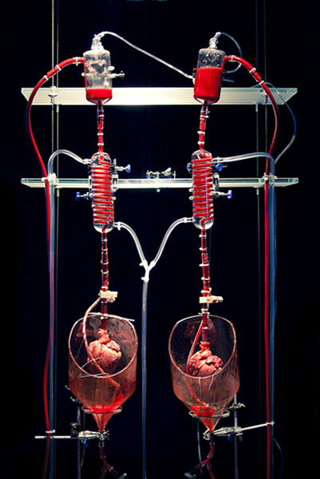
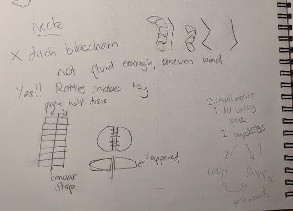

# 1701QCA Making Interaction - Assessment 2 workbook
## Monitor lizard with human: animate things ##
1.	**Conceptualisation**

1.1	Design Intent 

1.2	Research

1.3	Design concepts

1.4	Final Design

2.	**Fabrication Log**

2.1	Materials 

2.2	Connections

2.3	Servos 

2.4	Body, neck, propulsion

2.5	Pulleys 

2.6	LED

2.7	Heart module

2.8	Final Code

3.	**Steps towards final**

# 1. Conceptualisation #
## 1.1 Design intent ##
In short: Creating a clear visual and tactile link between “heart” and “life”, and the inverse, “no heart” and “no life”. 
My project aims to highlight the dependency of a user on a passive life-giving bodily process (heartbeat) that they have minimal agency over through a robotic animal. It will challenge notions of humans as “unnatural” or above nature. 

_Rationale: 
Why heartbeat, animal and animation?
We aren't often aware of the ongoing physiological processes of our body that keep us alive. When we are aware, I'd argue we don't think about them as "this is keeping me alive right now" and more "this is a passive thing my body does" i.e.: heartbeat. But I'd argue that your body is as much a result of your heartbeat as your heartbeat is a function of your body. Heartrate is my process of choice because it fits nicely into functions we barely notice, don't think much of but is very clearly vital and immediate. 
Technology and our systems of defying nature are pointed to as counterexamples of humans as moving past nature and often constitute the human identity, but humans will never "graduate" from being animals however advanced we may be. The biology that keeps alive fails to constitute our human identity, but we are united biologically with all other bilateral animals by this basal process._

_Other animals are an emotional bridge between our polar images of humans and nature. It is an unusual tension, in which we both dismiss animal behaviours as less sophisticated, less intended than ours, but also anthropomorphise them, projecting our supposedly uniquely human emotions and behaviours onto them. Observing animals allows us to conceive of people as biological and natural, despite superficial differences. Through similarity we empathise and recognise a consciousness even in something we don't like to identify with._

## 1.2 Research ##
_My research and designs engaged in dialogue during the conceptualisation process. It was not a linear process. The influence of the research linearly discussed below pertains to different stages in the development of the final monitor lizard project. Their influence is seen in more detail through experimentation and conceptualisation of specific designs discussed later._

### Related project 1 ###
[**Photovore Insect**](https://create.arduino.cc/projecthub/studikasus/walter-the-arduino-photovore-insect-708207?ref=tag&ref_id=robot&offset=17)

This project illustrates potential mechanisms of walking. Most importantly it illustrated that no complex pulley mechanisms that I was envisioning were necessary to move legs, just servos. 
It also provides a way for the animal to lift its legs while it moves them forward so it doesn’t push itself back. The central axil that pivots the front legs up and down supports my already conceived ideas for how the lizard would walk with shifting weight. This project illustrated to me how I could move all four limbs (my original design only had two moving limbs and 2 limp limbs) and maintain forward movement. 
It also suggests an alternative possibly more reliable way to shift weight through rotation of the legs themselves (like hips) rather than the whole body as I plan to. In my lizard this could be integrated into the current design as independently rotating back and front half of the lizard, with one doing the weight shifting and the other mostly propping the animal up. 

### Related project 2 ###

[**Helen Pynor’s _The body is a big place_**](http://www.helenpynor.com/heart_perfusion.htm)

Helen Pynor often works with grotesque imagery with a biological focus. This work relates to my rationale, taking the heart out of the body and illustrating its function. It’s important that this isn’t a representation of a heart but a literal pig’s heart that is made to function outside of a body through blood flow. I don’t believe any link is drawn between passive bodily functions and life, but maybe in some ways the opposite, the function of a heart even in absence of life which is quite grotesque. 
Still it pertains to the primacy of heartrate as something passive, lacking agency and still functioning. There is a clear lack of involvement from any conscious thought for this system to work. I aim to challenge our agency of our bodies in this regard too.
For concept 2 (which I discuss later) I draw on the imagery of a heart circulating blood and pumping a creature back to life. Concept 2 later influences concept 1 in the animation aspect. 

### Related project 3 ###
[**Monster Chan - The credit card walking robot**](https://www.robotshop.com/community/robots/show/monster-chan-the-credit-card-walking-robot)

This project also suggests another option for making my lizard walk. Walking was a particularly uncertain aspect for this project and more options give me a good safety net. Here instead of shifting weight, the middle legs act like a prop up for the side that needs to be off the ground. This is similar to how I have a nail propping up the lizard in the centre of the body, but this nail doesn’t move up and down. Instead it is used as a pivot point. 
If I continue to have trouble with making the lizard walk, I could easily implement a see saw style servo in the middle that props up the side that needs to be airborne at that point in the walking cycle. 

### Related project 4 & 5 & 6 ###
I have grouped these together because they are similar and serve a similar role in illustrating alternative ways of visualising heart rates and supporting that my lizard is at least somewhat original. Although no elements of these projects were burrowed, having alternatives is important.

[**Pulse**](http://www.jennykang.me/pulse)

This app uses your heart rate to generate natural fractal images of trees to emotionally connect the user with their heart rate. The project explores the psychology surrounding this imagery which is something I should’ve investigated. With a similar intent of drawing connection between humans and nature, this heart rate visualising app provided an alternative way to visualise heart rate early in the conceptualisation process. It was also more relevant to me when the project still had meditative function in which case, I would have strayed away from a lizard walking to something more abstract and emotionally resonant.  
It was also confirmation that there was a tendency to depict heart rate abstractly and not draw a link between heart and animation as strongly as I intend to, justifying my project. 

[**Heart Bot**](https://www.element14.com/community/groups/sensor-technology/blog/2015/01/05/heart-bot-is-a-heartbeat-interactive-art-installation)

A drawing robot draws a user’s heart rate as a waveform radiating from the centre next to all the other previous users heart rates. This project has a focus on heartrate as an identifier, something that is unique to you. It also looks at heartrate temporally, keeping public record of many people’s heart rates at those moments in time- heart as a timekeeper. This plays into the rhythmic and clocklike paradigms of heart. It uses something we see in a medical context (ECG) as a collaborative medium. 
The concept of this installation is someone relevant to me, in highlighting the passive nature of the heart, but instead looks at the identifying rather than life giving quality of your heart. Although one could argue the medical connotations of the ECG do carry life and death meanings. 

[**Heart Bloom**](http://heartbloom.rogierarents.nl/ddw.html)

Very similar to Heart Bot, except here the waveforms are drawn by a drawing bot into the shape of a flower (plant imagery like Pulse). It is also collaborative, with the audience pinning up their unique heart flowers onto a wall. There is emphasis on heart rate as an individual identifying thing and as an emotional gauge. Identifiable flower shapes are indicative of certain states like anger or relaxation. 
I believe I offer quite a different outlook on heart rate to this and the previous two projects. I do not believe heart rate being unique has much to offer aside from novelty in repetition. 

### Related project 7 ###
[**Push puppets**](https://www.youtube.com/watch?v=F0php4pwrZc)

This is less of a concept and more of an existing design mechanism in the toy market that I’m drawing on. It was important in figuring out how I would slump over my lizard (“dead mode”) in concept 2 and later in the final project. Keeping strings that run through hard pieces taught is the mechanism that I settled on that I achieved with a pulley. Without my previous interaction with these toys I wouldn’t have this option available to me, even if it turns out that I can’t use it. 

### Related project 8 ###
[**Scientists bring a fossil back to life**](https://www.nature.com/articles/d41586-019-00186-x)

This is the video that lead my project from the beginning of the year. This is the image that I had in my head when thinking about concept 1 and largely has stayed this way in terms of presentation. I think it demonstrates that something can be “brought back to life”, even replicas of bones, by making it walk, and I was quite attached to this idea. Animation through movement feels very intuitive now. 
I drew a lot on how this reptile moves like where the legs are during contact, with what rhythm they move (do they move together or one at a time) and what role necks and tails play in balance. There is a rhythm here that is very easy to visualise. It is common to many reptiles because of the position of their hips (splayed walking). I went with “lizard” as my animal of choice because of the clarity this video offered to me. 
### Other research ###
**Walking cycles**

Although I had a clear image of the walking cycle from the robot fossil, life reference is still relevant. 
[This monitor lizard video](https://www.youtube.com/watch?v=t9z80QzM1xE) shows how exaggerated those positions of the head, neck and legs are. Just like the robot fossil, it moves by picking up diagonally opposite legs (back right, front left) and at the same time pushing off with the other two making that are making contact. 

This is in contrast to the walking cycle of mammals, who’s legs are angled underneath the hips rather than out (splayed). It is typical for mammals to walk (although there are other gaits) by picking up legs sequentially. Even if multiple legs may be off the ground at the same time, they are not moved together (back right, front right, back left, front left). This is difficult to describe, but is evidence in this [video of a dog walking]( https://www.youtube.com/watch?v=3Af2GDhRafQ).

This is important as a backup walk cycle in case it is necessary for only one side to be airborne at a time and still look natural. 

**Making a robot feel alive and empathising with it**

As discussed in my rationale, empathising with the robot is important to conceive of yourself as natural. For that reason the robot should also feel natural despite being a robot. [This article](https://thenextweb.com/podium/2019/08/16/heres-how-we-should-design-companion-robots/) gives tips on how to make companion robots, so robots that are easy to view as living and empathise with. My takeaways for my lizard were that it needed to show vulnerability. For me that meant definitely making it dead when you weren’t connected with it, taking priority over making it walk exactly how I wanted it to. This led to the implementation of elements of concept 2 (slumping over) into concept 1. The article also suggests that the robot servo no practical function if it is a companion robot, supporting my decision to not make it a meditative aid. 

**Conversations with people around me**

When I asked them what else I could measure aside from heart rate they had some suggestions. Heartrate is by far the most practical and emblematic option, but I couldn’t choose it without considering other options. 

The suggestions were: 
body heat, blood pressure. The fluctuations in these are too gradual (over the course of hours) I also considered sleep which fits in this category. 
Breathing, strength (pressure). These are too voluntary. 

My friend also suggested the cooperative concept (like concept 4)- a car which each wheel controlled by a different person’s heart rate. 

## 1.3 Design Concepts ##
### Design concept 1: Chosen concept ###
Concept 1: A lizard that crawls in time/half time with your heartbeat.

_**Pros**: movement is a good link of heartbeat = animation. Perfect execution is not necessary for a functioning execution. It is moderately engaging, especially if the lizard can avoid obstacles. The user has a bit of agency with how quickly the lizard crawls._  

_**Cons**: If the lizard stops moving it does not appear dead, it just looks like its stopped walking. It’s not the strongest link between heart and animation._

### Design concept 2 ###
A creature that slumps over dead when there is no heartbeat. When you connect to it, it pumps up with blood and stands rigidly either due to pressure or with a different hidden mechanism but appearing to be pressure. The mechanical heart continues to contract to the user’s rhythm after that, filling all the plastic tubing vessels with blood and visibly circulating (like Helen Pynor's "the body is a big place"). It is like a soft bottle filled with red liquid that gets squeezed by a motor. There is minimal other movement, maybe just a wiggle. When the heart stops beating all the liquid goes back to the heart. 

_**Pro**: It's got big spectacle. It connects strongly to ideas of life or absence of life as a direct result of the heart._ 

_**Con**: This project relies heavily on the spectacle of blood circulating through the body, and therefore relies heavily on technical finesse. There is little margin of fault here before it looks bad. Aside from that, I think the interactivity of this is very limited, and would lose novelty fast._

### Design concept 3 ###
A competitive game in which each user controls and races with a small crawling creature with their heart rate. The faster the heart rate, the faster it goes. 

_**Pro**: This concept is the most engaging through competitive play and I think seeing the mildly unhealthy ways people try to increase their heart rate would be very entertaining (hyperventilation, jogging on the spot, inducing anxiety, all sound kind of terrifying but also thrilling)._

_**Con**: But in its competitive engagement it also detracts from the link between heart and animation, heart as life giving. Instead it becomes heart as an aid to victory. Users would certainly pay extra attention to their heart, but only to win, not live._

### Design concept 4 ###
A similar idea to 3, except cooperative rather than competitive. Users need to match their heart rate (matching the beats themselves would be too hard). Each user controls one half of a crawling creature. When they are synchronised, it crawls well. When their heart rates are too different, it crawls erratically. 

_**Pros**: I think this is an equally engaging concept. It also doesn’t encourage unhealthy behaviours. It has a positive awareness of the heart, and as something that is shared between you, another person, and the creature. That fits my message quite strongly._ 

_**Cons**: but ultimately, I think it still misses the animation aspect of the heart. I also think it might be too hard to match heart rates. Often users will feel frustrated by the necessary lag._
  
## Design process discussion ##
Using the Double Diamond design methodology resulted in the following outcomes:

**_these are also illustrated in the diagram below as I realise this is a lot of writing_**

**Discover**

During the discover stage I attempted to not assume the solution. I put my current idea (concept 1) on hold in order to develop a variety of concepts. 

I considered many options for which vital function to measure and how to visually represent them, even the obviously bad options (measuring sleep is an impractical idea for a project like this) as to not overlook any unexpected solutions. There were explorations into concepts aside from vital functions, into interactive creatures that encouraged positive awareness of self in other ways, such as shy robots that need a gentle approach. I considered using live insects as possible input. 

I consulted the opinions of others, presenting them with options and asking them how they’d react to each one, noting which ones got the response I wanted. My message was best communicated through concept 1 and 2. 3 and 4 seemed to be the most engaging. 

**Define**

In the define stage, I considered the most important aspects of my project, selected and refined the concept.  

_Life/death binary aesthetics_

The lizard needed to look and feel alive when you connect it to your body. I determined that the best way to communicate that a creature is being animated is for it to be dead in the first place: a binary was the most important element of the lizard’s behaviour. The robot companion article also recommended making your robot vulnerable and what better way than to give the power to give and take the life of this lizard. 

I imagined what can communicate the binary. Visual aids like LEDs and audio aids like speakers came to mind, but they were only sufficient as a supporting role. Concept 2 came into play here with the slumping over. I envisioned a pulley system being implemented, influenced by push puppet mechanisms. I also considered that I could integrate a small circulatory system on the walking lizard but decided that was not feasible with the time and resources I had available. Concept 2 would also be too difficult because it deals predominantly with liquids and pressure.

_Gait and movement mechanisms_

My lizard needed to move in a way that seemed intended if I couldn’t make it walk, but ideally it should walk. The walking lizard will either have to use an ultra-sonic distance sensor or walk in a circle. Latter may be necessary depending on the range of the radio signal. I’m reluctant to allow the user to control the lizard’s direction of movement. It needs to be just enough to be engaging but not excessive because the work is about an involuntary process.

I considered whether it has to move on legs at all. I determined it does because it needs to move rhythmically with the heartrate not continuously, but if legs were too difficult to implement I would be happy to support it on a wheel, or if it still didn’t work I would be willing to add a motorised wheel to propel it but reluctantly. 
I decided if I couldn’t make it walk, I would rather make it “dance”, possibly incorporating a cooperative element as compensation for engagement.  

_Heartrate measurement_

The heart rate sensor needs to be accurate enough that there is a clear “beat” and “no beat” that can be counted towards BPM. This is true for any of the concepts. 

It needs to move independently from the user and heart rate sensor because it is a separate living being, so I will use radio between two Micro:bits. 

**_Below is a diagram illustrating my selection process, resolution of anticipated issues and the influence of other concepts on my selected concept._**

## 1.4 Final design concept ##
The refined concept 1 now incorporated elements from concept 2 and potentially from concept 4.
A lizard is animated by a user’s heart. When a heartrate is first detected, its limp body becomes rigid. After that it goes through a walking cycle at the same rate as the user’s heart, with a bright LED pulsating in time under its skin as well. When the user removes their finger from the sensor, the lizard is limp again. 

### Interaction flowchart ###

# 2. Fabrication Log #
## 2.1 Materials ##
**I bought various materials for my project (crossed out items were not used in final):**

	•	~~WAGO lever wireless connectors~~

	•	Electrical tape

	•	a second microbit

	•	a 10mm red LED

	•	4 small servo motors (SG-90)

	•	1 large servo motor (6V)
	
	•	A microbit shield with extra pin holes 

	•	~~A MAX30100 pulse sensor~~

	•	~~Another pulse sensor~~

	•	Another-nother pulse sensor
	
	•	A pulley wheel

	•	Crimping tool, electrical tape

	•	~~27 Ohm resistor~~

	•	1 6v and 3 3v slot battery packs

	•	~~Ultrasonic distance sensor~~

	•	Plastic glue

**Some things I already owned:**

	•	The first microbit

	•	Assorted screws, nuts and bolts from around the house

	•	Thermoplastic beads
	
	•	Binding wire

	•	Nylon string

## 2.2 Connections ##
The WAGO connectors do not work for 1m wire. All my connections will have to be solderless for the meantime and use twist and tape method from the replication project. 
## 2.3 Servo Basics ##
I already knew how to operate servos from classwork. I used a simple bit of code with button a and b presses corresponding to different servo positions to test functionality of my connections. 

First I connected a servo just to the microbit (Input line, Vin and Ground) and found out in [this forum](https://arduino.stackexchange.com/questions/40145/micro-servo-is-not-working-with-arduino-uno) that if the Micro:bit is also connected to a computer via USB, it makes the servo jitter because the voltage is too high. I keep this in mind for the rest of my experimentation, but I will be using an external battery pack for most of it. 

Connecting the external power source I learned (from this [video](https://www.youtube.com/watch?v=9qgABVkvbYI)) that the battery pack ground also has to connect to Micro:bit ground. 

Adding more servos (four in total, they started jittering again. It appears jittering has everything to do with power. I needed to increase from my 3V to a 6V external power source and they worked again. 

In later experiments I kept finding that batteries were running out quite quickly and that was often the reason my servos stopped working suddenly. 
## 2.4 Body, neck, propulsion ##
### Propulsion ###
Once I got all four servos to work, I realised that it would definitely move in place even with legs because the servo arms touch the ground on the clockwise and anticlockwise rotation, undoing movement. 

I understood that my designs involving shifting forward weight with the head were necessary to make it walk. This is supported by the photovore insect project and Monster Chan from my research. 
The neck tilts right, shifting the weight off the right side via the central propping pivot. At the same time, the front left leg is lifted up and it can move forward. The right front leg that was already forward now pushes off. The inverse is happening with the back legs. When this motion is completed, the neck tilts left and the inverse occurs. The servo angles representing each of these movements are listed on this page. 

I ditched the tail as another shifting weight (tail 2) as the servo count was getting expensive. However I do retain the tail as a counterweight for all the weight at the front (tail 1). 

Also on this page I investigate how the servos should be angled relative to the body. I nonsensically thought that angling them a certain way would prevent contact on the legs movement back. Option 2 is influenced by the photovore project, but I decided against it because it requires constant contact to push off since its vertical position doesn’t change. I went with option 1.5 because it moves the body back and away so that it moves in a sort of zig zag motion, ideally. 

### Body ###
I made the frame out of thermoplastic with a slight upward angle in the sides for the servos to sit on. I held everything down temporarily with screws, and the legs were bound to the servo arm with wire running through drill holes. A large screw supported the body in the middle. The wires were fed through a hook.

I had some issues and I didn’t get to test out how all the legs moved together. At first, I thought it might be something wrong with the Input line connection to one of the pairs of legs as the front right and back left were only twitching, but I soon discovered the ground wire of one of the servos was connected to the input line on the Micro:bit and that was messing with the signal of the other servo on that pin.  To keep In mind for the future.

I couldn’t test out how well this body moved. In the process of connecting one of the servos with the leg I broke it. Another servo had a gear that was thicker than all the little plastic arms that it came with. I forced one of them on it, which widened the arm. I forgot this and later when the last arm I had left was too loose for the last servo and I used a screw to secure it. I guess I used the wrong screw, because it loosened the gears inside the servo and I couldn’t fix it. I bought another one later, but for now, there’s how the front legs move without a neck.

### Neck ###

The neck saw some design iterations from the original. I realised the original bike chain design wouldn’t turn evenly through the spine, and that how well it turned greatly depended on the friction between the pieces. This was too much precision for me.

I changed the design modelling it after my friend’s crocodile rattle toy like this one:

I thought I could skimp out on work just by connecting the plates with thread, but there was too much rotational movement and I realised I would have to adhere to the original crocodile with a strip of canvas running through the middle as it only has one axis of movement.

I used super glue to join the neck pieces to the canvas.

Although I had to add a supporting wire to the neck. The neck tended to curve back so much that when the servo turned to the other side it didn’t follow. It also bowed too much. 

The supporting wire was quite a nice result. It has a good bobble to it.

In my plans, the degrees for left and right were a bit extreme (45 and 135). After settled for an average between those and neutral (90) and it worked well. 

## 2.5 Pulley tension ##
The pulley works by threading nylon string through the joints and loosening or tightening it up with a stronger motor (6V) with a disc. When it’s tight, the joints come together rigid in a lock and key fashion. The string is guided through the body with eye screws. In my original sketches this lock and key was round.

The sphere was too slippery though and even while rigid the limb rotated.

Next I tried a cube lock and key, but it turned out too tight and would slot correctly without effort from me. It is a good lego-style slot in though, quite strong and may be useful in future projects. 

Lastly I went for in-between: a pyramid lock and key (lock indented with edge of sharpener). To my surprise this worked. The leg is soft when the pulley is at the original position, and tight enough that it can bring the lizard up off the ground I believe when the pulley is at maximum (180) position. 

## 2.6 LED ##
The 1cm LED that I bought is very bright as promised. It will diffuse quite well through the lizard’s skin. But I did my maths wrong after all. The guy at the store who helped me find the 27 ohm resistor that I thought I needed according to my maths said that one should only need a 47 ohm resistor according to his book. 

The maths I did was influenced by this [site]( https://www.evilmadscientist.com/2012/resistors-for-leds/). 

There is a 2.4V drop according to the manufacturer._

I’m bringing that down from 3V

	3 – 2.4 = 0.6V

	V = I*R 

	0.6 / 0.025 (suggested value) = R

	R = 24 ohms

Oh well! It definitely works with 47ohm.

Some basic loops that look like a heart:

## 2.7 Heart Module ##
### MAX30100 ###
There were a lot of issues with the heart rate monitor. The one I originally used was MAX30100. 

It was made for Arduino and not for Micro:bit as it’s pins connect to the clock and data pins of the Arduino. Furthermore, the [library](https://github.com/mfitzp/max30100) I learned some Micropython for seems to be written in Python and needs to be adapted to Micropython to actually work, which is way beyond my capacity. This is according to this [forum](https://forum.micropython.org/viewtopic.php?t=8101&p=46069). I assume this is why it was giving me memory errors.

I did learn all the Micropython commands I knew in MakeCode, how to import a library and how to use the serial screen. 

### Pulsesensor.com knock off ### 

That nightmare ended when my backup analog heart module arrived in the mail. It seemed quite similar to the PulseSensor.com sensor so I just followed the Micro:bit instructions on their website: Vin to 3v, G to ground, Input to any pin and just read analog pin for signal. 
It worked well, with clear “beat” and “no beat”. Although I found that the pressure applied was very important. Too much and the signal was maximum (1032), too little and it stayed pretty low (<300) and didn’t fluctuate much in both instances. Also very strangely sometimes the sensor detected a pulse on my desk which I can only guess has something to do with my lamp. 

Next I needed to figure out how to detect a beat and make sure this sensor was accurate, but **IT BROKE! The connections were soldered on and didn’t take much twisting. I ordered the actual pulsesensor.com one.** 

I thought about two methods for when the next one comes. Until then I will use the simulator, dragging the pin up and down in time with a metronome:

**method 1**

If PS is 0, and within X time it is >500, count that as a beat, otherwise the time expires and repeat. Make  a counter for the beats and after 15 seconds display beats per minute. 

**method 2**

Alternatively, if PS = 0 and PS > 500 in time X, mark upper or lower with timestamp, repeat for next beat and subtract the timestamps. Average out after 30 times gives average time in between beats (this is similar to my timing gate replication project). 

### Method 1 ###

**Step 1: detecting a beat** 

When signal is above 370, box 1 is checked

When signal is below 100, box 2 is checked

Both boxes checked, count as beat, increase ‘beat’ by 0.5 because the beat is counted twice, on the rise and fall. 
Uncheck boxes.  

**Step 2: Timer**

Adding a clock that shows T for 10 seconds and displays BPM (number of beats X 6) afterwards, then resets beat counter. 

**Step 3: Timer linked to beats**
While timer box is unchecked measure for beats. When it is checked show BPM. 

**Step 4: Testing if this method gives accurate BPM**

I have to test accuracy with manual inputs guided by a metronome, so there’s a degree of human error. A few trails gave these values:

So accurate enough, at least the system. Might take adjustments with sensor when it arrives.  

I can also decrease the sample from 10 seconds to 5 if it feels too laggy on the user (probably will).

Method 2

I am dismissing this method because method 1 is effective enough. It also didn’t account for the return of the beat from 1032 back to 0 (shouldn’t be counted as a beat). This is dealt with in method 1 simply by halving it. The 10 second period is an average already. But the returning “beats” cannot be counted in method 2 because this produces in inconsistency in time (illustrated below) This could most likely be worked around but at this point it is needlessly more complicated. 

## 2.8 Putting the code together ##
Through this log I’ve developed all the components that now need to be brought together. Below is the illustration of how:

Sender Micro:bit

Receiver Micro:bit

How it’ll be arranged on the body of the lizard

###The code###
**Sender:**
_Heart code_

Identical to final heart code in section 2.7 

. 

	If bpm is 70 beats per minute, how much time is that in between each beat?

	Bpm/60 = 0.8 seconds. 

	0.8 x 1000 = 800 ms

. 

Some maths converting the four current millisecond increments to fractions: 

8 X 30 = 240 

2 x 50 = 100

1 x 1000 = 1000

1 x 100 = 100

	= 1540 ms total duration of cycle
	
	
30ms/1540 = 0.019 

50ms/1540 = 0.032  

100ms/1540 = 0.065

1000ms/1540 = 0.649

 

_Servos_

On start: dead mode. When rhythm detected, tense up and straighten neck. After that, loop walking cycle separated by “wait” time. 
If wait stops being above 10ms, go back to dead mode. 

_Final touches_

On sender Micro:bit:
To ensure that only a finger will set off the timer, skin should close a circuit and press a pin (pin 0). 

If it’s not pressed, then timer is set to 2 so it doesn’t affect anything and radio signal is 0. 

If it is closed, draw heartrate bar graph on LED screen (feedback for user)

Indicate readiness but absence of input if pin 0 is not closed with LED dot. 

 

# 3. Steps towards final #
1.	I am worried that the pulley motor is much stronger than the walking motors and will overpower them. I need to connect a leg to both a pulley motor and a walking motor to ensure this is not the case. The pulley should pull directly above the walking motor to prevent left or right pull. 

_If this doesn’t work I will consider propping the lizard up on a wheel to reduce effort required to walk and therefore can reduce the tension in the string._

2.	I need to put the neck component with the walking component and ensure the balancing works like it does in my head. 

_If it doesn’t work I might have to make sure that only one sided at a time is moving its legs forward instead of diagonally opposite legs. 

Otherwise the back legs, which I think might conflict with the front legs, can be looser than the front so that they don’t actually push much. I would have to put the propping up nail in the back centre then._

3.	When walking is implemented I will also have to implement obstacle avoidance or make it turn automatically.
4.	I need to design how I present the heartrate monitor and its Micro:bit to the user.
5.	Wires and gears should be covered up, possible with faux fur or other flexible fabric 
